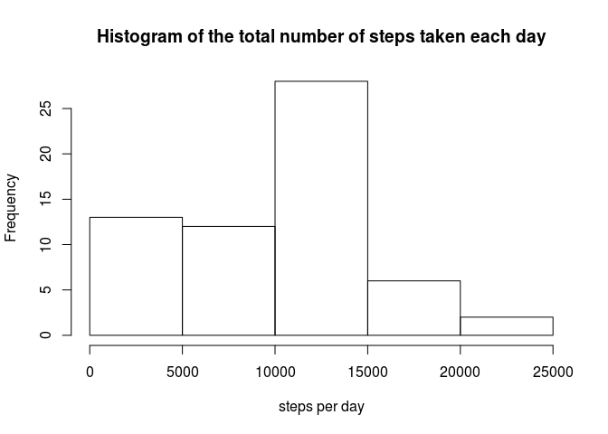
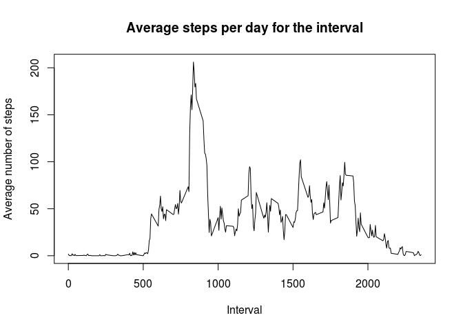
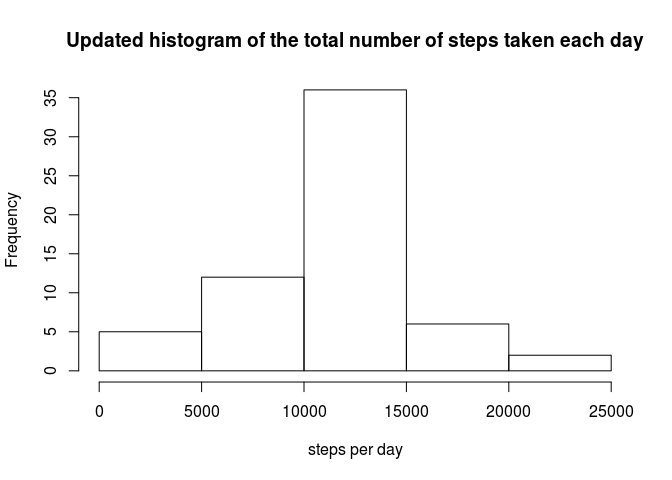
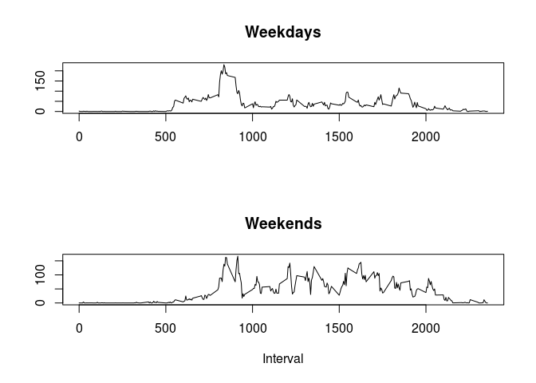

# Reproducible Research: Peer Assessment 1


## Loading and preprocessing the data

Silently load dplyr package:


```r
library(dplyr)
```

1. Read activity data from CSV file.

```r
activity <- read.csv('activity.csv')
```

## What is mean total number of steps taken per day?

1. Group data by date and then apply sum function over number of steps to get mean total number of steps taken per day:

```r
steps_per_day <- tapply(activity$steps, activity$date, sum, na.rm=TRUE)
```

2. Histogram:

```r
hist(steps_per_day, main="Histogram of the total number of steps taken each day", xlab="steps per day")
```

 

3. Mean and median of the total number of steps taken per day:

```r
mean(steps_per_day)
```

```
## [1] 9354.23
```

```r
median(steps_per_day)
```

```
## [1] 10395
```

## What is the average daily activity pattern?

1. Group data by interval and then apply mean function to get average number of steps per interval. 

```r
daily_activity <- activity %>% group_by(interval) %>% summarise(average_steps=mean(steps, na.rm=TRUE))
```

Now, make time series plot from these data.

```r
plot(daily_activity$average_steps ~ daily_activity$interval, type="l", main="Average steps per day for the interval", xlab="Interval", ylab="Average number of steps")
```

 

2. Arrange data by average number of steps in descending order. Then choose the first interval - it corresponds to the maximum number of steps:

```r
ordered_activity <- arrange(daily_activity, desc(average_steps))
first_item <- ordered_activity[1,]
print(first_item$interval)
```

```
## [1] 835
```

## Imputing missing values

1. Calculate number of rows with missing values.


```r
sum(is.na(activity$steps))
```

```
## [1] 2304
```

2. Missing data will be imputed by taking a mean of steps for that interval over all days.

3. Build a new dataset with imputed missing data. Merge activity and daily activity datasets on interval column. Then build a new dataset with updated steps column.

```r
merged <- merge(activity, daily_activity, by.x="interval", by.y="interval")
upd_activity <- merged %>% mutate(imputed_steps=ifelse(!is.na(steps), steps, average_steps)) %>% select(date, interval, imputed_steps) %>% rename(steps=imputed_steps) %>% arrange(date, interval)
```

Repeat calculation of mean steps per day with updated data (ne need to drop NA as there is none):


```r
upd_steps_per_day <- tapply(upd_activity$steps, upd_activity$date, sum)
```

3. Histogram for an update data:

```r
hist(upd_steps_per_day, main="Updated histogram of the total number of steps taken each day", xlab="steps per day")
```

 

Mean and median of the total number of steps taken per day for update data:

```r
mean(upd_steps_per_day)
```

```
## [1] 10766.19
```

```r
median(upd_steps_per_day)
```

```
## [1] 10766.19
```

## Are there differences in activity patterns between weekdays and weekends?

1. Create a new factor variable in the dataset with two levels – “weekday” and “weekend” indicating whether a given date is a weekday or weekend day:    

```r
upd_activity <- mutate(upd_activity, wday=ifelse(weekdays(as.Date(date)) %in% c("Šeštadienis", "Sekmadienis"), 'weekend', 'weekday'))
```

2. Group data by interval and then apply mean function to get average number of steps per interval. Do that for weekdays and weekends separately: 

```r
upd_daily_activity_weekdays <- upd_activity %>% filter(wday=='weekday') %>% group_by(interval) %>% summarise(average_steps=mean(steps, na.rm=TRUE))
upd_daily_activity_weekends <- upd_activity %>% filter(wday=='weekend') %>% group_by(interval) %>% summarise(average_steps=mean(steps, na.rm=TRUE))
```

Now, make panel plot from these data.

```r
par(mfrow=c(2,1))
plot(upd_daily_activity_weekdays$average_steps ~ upd_daily_activity_weekdays$interval, type="l", main="Weekdays", xlab="", ylab="")
plot(upd_daily_activity_weekends$average_steps ~ upd_daily_activity_weekends$interval, type="l", main="Weekends", xlab="Interval", ylab="")
```

 

